<div align="center">


# ✈️ VistaVoyage

### *Your World. Your Way.*

**AI-Powered Travel Discovery Mobile Application**

<br/>

[](https://flutter.dev)
[](https://dart.dev)
[](https://supabase.com)
[](https://console.groq.com)
[](LICENSE)
[](https://flutter.dev)

<br/>

> Discover world-class destinations, save your favorites,
> and let AI plan your perfect trip — all on **100% free services**.

<br/>

[✨ Features](#-features) &nbsp;•&nbsp;
[📱 Screenshots](#-screenshots) &nbsp;•&nbsp;
[🛠️ Tech Stack](#️-tech-stack) &nbsp;•&nbsp;
[🚀 Getting Started](#-getting-started) &nbsp;•&nbsp;
[📁 Structure](#-project-structure) &nbsp;•&nbsp;
[📋 Submission](#-semester-project-submission) &nbsp;•&nbsp;
[👥 Team](#-team)

</div>

---

## 📖 About The Project

**VistaVoyage** is a beautifully crafted cross-platform mobile application built with **Flutter** that transforms how people discover and plan their travels. Browse stunning destinations, build a personal favorites collection, and get AI-generated personalized itineraries — powered by the **Groq API** and **Llama 3.3 70B**.

The entire app runs on **free-tier services** — no billing, no credit card — making it perfect for student projects and indie developers.

### 🎯 What Makes It Special

- 🔒 **Secure** — Supabase Row Level Security on all user data
- 📴 **Offline-First** — 10 destinations load instantly without internet
- 🤖 **Actually Smart AI** — Real Llama 3.3 70B responses, not templates
- 💅 **Production UI** — Glass morphism, hero animations, travel photography
- 🔔 **Push Notifications** — Local notifications with permission handling
- ⚙️ **Full Settings** — Settings menu + dedicated settings screen
- ⚡ **Zero Cost** — Supabase Free + Groq Free = $0/month forever

---

## ✨ Features

<table>
<tr>
<td width="50%">

### 🔐 Authentication
- Email & password sign up and sign in
- Powered by Supabase Auth
- Auto-login — session persists across launches
- Personalized greeting with username
- Error banners for invalid credentials

### 🌍 Destinations
- 10 curated global destinations
- Offline-first local seed data
- Live search by name or country
- Rich cards — image, rating, tags, budget

### ❤️ Favorites
- Cloud-synced via Supabase PostgreSQL
- Swipe left to delete
- 3-second undo snackbar
- Illustrated empty state

</td>
<td width="50%">

### 🤖 AI Travel Assistant
- Groq API — Llama 3.3 70B Versatile (Free)
- Auto 3-day itinerary on screen open
- Free-form travel Q&A chat
- Animated typing indicator
- 6 quick-prompt chips

### ⚙️ Settings & Notifications
- Slide-up settings menu from home AppBar
- Dedicated settings screen with toggle switches
- Push notification permissions & test trigger
- Dark mode toggle, notification preferences
- Secure Supabase logout

### 📱 UI / UX
- Travel photo backgrounds on auth screens
- Glass morphism input fields
- Hero image on detail screen
- Material Design 3 throughout
- Playfair Display + Nunito typography

</td>
</tr>
</table>

---

## 📱 Screenshots

<div align="center">

### Auth Screens

| Splash | Login | Sign Up |
|:---:|:---:|:---:|
| *Splash screen* | *Glass inputs + Supabase auth* | *Separate amber-themed screen* |

### App Screens

| Home | Detail |
|:---:|:---:|
| *Live search + 10 destination cards* | *Hero image + highlights + AI button* |

| Favorites | AI Chat |
|:---:|:---:|
| *Swipe to delete + cloud sync* | *Llama 3.3 itinerary + quick prompts* |

| Settings Menu | Settings Screen | Notifications |
|:---:|:---:|:---:|
| *Slide-up bottom sheet* | *Toggles + preferences* | *Push notification setup* |

</div>

---

## 🛠️ Tech Stack

<div align="center">

| Layer | Technology | Version | Purpose |
|:---:|:---:|:---:|:---|
| 📱 **Frontend** | Flutter | 3.x | Cross-platform UI — Android & iOS |
| 💻 **Language** | Dart | 3.x | Strongly typed, async-first |
| 🔐 **Auth** | Supabase Auth | 2.x | Email/password authentication |
| 🗄️ **Database** | Supabase PostgreSQL | — | Favorites with Row Level Security |
| 🤖 **AI Model** | Groq — Llama 3.3 70B | — | Travel itinerary generation |
| 🌐 **HTTP** | Dart `http` package | 1.2.1 | Direct Groq API calls |
| 🔔 **Notifications** | flutter_local_notifications | 17.x | Local push notifications |
| 🔑 **Permissions** | permission_handler | 11.x | Runtime permission requests |
| 🎨 **Design** | Material Design 3 | — | UI components and theming |
| 🔤 **Fonts** | Playfair Display + Nunito | — | Title + body typography |

</div>

---

## 🌍 Featured Destinations

<div align="center">

| # | 🌏 Destination | Country | ⭐ Rating | 🏷️ Tags | 💰 Budget/Day |
|:---:|:---|:---|:---:|:---|:---:|
| 1 | 🗼 **Paris** | France | 4.9 | Romance, Art, Culture, Food | $150–$300 |
| 2 | 🗾 **Tokyo** | Japan | 4.8 | Technology, Food, Culture, Nightlife | $100–$200 |
| 3 | 🏝️ **Santorini** | Greece | 4.8 | Beach, Romance, Scenic, History | $200–$400 |
| 4 | 🏙️ **Dubai** | UAE | 4.7 | Luxury, Shopping, Adventure, Modern | $200–$500 |
| 5 | 🌴 **Bali** | Indonesia | 4.7 | Nature, Spiritual, Beach, Adventure | $60–$150 |
| 6 | 🗽 **New York City** | USA | 4.8 | Urban, Culture, Food, Shopping | $200–$400 |
| 7 | 🐠 **Maldives** | Maldives | 4.9 | Beach, Luxury, Diving, Romance | $400–$1000 |
| 8 | 🏛️ **Rome** | Italy | 4.8 | History, Food, Art, Culture | $120–$250 |
| 9 | ⛰️ **Cape Town** | South Africa | 4.7 | Nature, Adventure, History, Wine | $80–$180 |
| 10 | 🕌 **Istanbul** | Turkey | 4.7 | History, Culture, Food, Architecture | $60–$150 |

</div>

---

## 🚀 Getting Started

### Prerequisites

```bash
flutter --version    # Need Flutter 3.x or higher
dart --version       # Dart 3.x included with Flutter
```

Also create free accounts at:
- 🟢 [supabase.com](https://supabase.com) — database & auth
- 🟠 [console.groq.com](https://console.groq.com) — AI API

---

### Step 1 — Clone the Repository

```bash
git clone https://github.com/QaswarSarfrazcodes/Vista-Voyage-.git
cd Vista-Voyage-
```

---

### Step 2 — Image Assets

All images are included in `assets/images/`:

```
assets/images/
├── splash.jpg              ← Dramatic travel photo
├── login_bg.jpg            ← Scenic landscape
├── signup_bg.jpg           ← Adventure photo
├── logo.png                ← App logo (512×512)
├── placeholder.png         ← Fallback image
├── empty_favorites.png     ← Empty state illustration
├── dest_paris.jpg
├── dest_tokyo.jpg
├── dest_santorini.jpg
├── dest_dubai.jpg
├── dest_bali.jpg
├── dest_newyork.jpg
├── dest_maldives.jpg
├── dest_rome.jpg
├── dest_capetown.jpg
└── dest_istanbul.jpg
```

---

### Step 3 — Supabase Setup

**a)** Create a free project at [supabase.com](https://supabase.com)

**b)** Go to **SQL Editor → New Query**, paste and run the SQL from `supabase_setup.sql`

**c)** Create a `.env` file in the project root:

```
SUPABASE_URL=https://YOUR_PROJECT_ID.supabase.co
SUPABASE_ANON_KEY=YOUR_ANON_PUBLIC_KEY
```

---

### Step 4 — Groq API Key

**a)** Sign up free at [console.groq.com](https://console.groq.com)

**b)** Go to **API Keys → Create API Key**

**c)** Add your key to `.env`:

```
GROQ_API_KEY=gsk_YOUR_KEY_HERE
```

> ✅ Free forever · No credit card · 30 requests/minute

---

### Step 5 — Run the App

```bash
# Install all dependencies
flutter pub get

# Run in debug mode
flutter run

# Build release APK
flutter build apk --release
```

---

## 📁 Project Structure

```
Vista-Voyage-/
│
├── 📁 assets/
│   ├── 📁 fonts/                          # Playfair Display + Nunito
│   └── 📁 images/                         # 17 image assets
│
├── 📁 lib/
│   ├── 📄 main.dart                       # Entry point + routing + theme
│   ├── 📁 models/
│   │   └── destination_model.dart         # Data model
│   ├── 📁 screens/
│   │   ├── splash_screen.dart             # Launch + auth check
│   │   ├── login_screen.dart              # Sign In
│   │   ├── signup_screen.dart             # Create Account
│   │   ├── home_screen.dart               # Main feed + search + settings icon
│   │   ├── detail_screen.dart             # Destination detail + AI button
│   │   ├── favorites_screen.dart          # Saved destinations (Supabase)
│   │   ├── ai_screen.dart                 # Groq AI itinerary chat
│   │   ├── settings_menu.dart             # Slide-up bottom sheet menu
│   │   ├── settings_screen.dart           # Full settings with toggles
│   │   ├── notifications_screen.dart      # Push notification management
│   │   ├── profile_screen.dart            # User profile
│   │   ├── map_screen.dart                # Destination map view
│   │   └── support_screen.dart            # Help & support
│   ├── 📁 services/
│   │   ├── supabase_service.dart          # Auth wrapper
│   │   ├── supabase_data_service.dart     # CRUD + seed data + favorites
│   │   ├── ai_service.dart                # Groq API client
│   │   └── notification_service.dart      # Local push notifications
│   ├── 📁 theme/
│   │   └── app_colors.dart                # Color palette
│   └── 📁 widgets/
│       └── destination_card.dart          # Reusable destination card
│
├── 📁 screenshots/                        # Architecture & workflow diagrams
├── 📁 test/
│   └── widget_test.dart
├── 📄 supabase_setup.sql                  # DB schema + RLS policies
├── 📄 user_stories.md                     # 9 User Stories (Task 2)
├── 📄 PROJECT_VERIFICATION_REPORT.md      # Submission checklist
├── 📄 pubspec.yaml
└── 📄 README.md
```

---

## 🗄️ Database Design

```
┌──────────────────────────────────────────────────────────┐
│                    destinations                          │
├─────────────────┬────────────────────────────────────────┤
│ id              │ TEXT PRIMARY KEY  e.g. "paris"         │
│ name            │ TEXT                                   │
│ country         │ TEXT                                   │
│ imageUrl        │ TEXT              asset path / URL     │
│ isAsset         │ BOOLEAN           true = local file    │
│ description     │ TEXT                                   │
│ rating          │ NUMERIC(3,1)      0.0 – 5.0           │
│ tags            │ JSONB             ["Romance","Art"]    │
│ highlights      │ JSONB             ["Eiffel Tower",...] │
│ bestTime        │ TEXT              "April – June"       │
│ avgBudget       │ TEXT              "$150–$300/day"      │
└─────────────────┴────────────────────────────────────────┘

┌──────────────────────────────────────────────────────────┐
│                      favorites                           │
├─────────────────┬────────────────────────────────────────┤
│ id              │ UUID PRIMARY KEY  auto-generated       │
│ user_id         │ UUID → auth.users(id)                  │
│ dest_id         │ TEXT                                   │
│ dest_data       │ JSONB  full destination snapshot       │
│ created_at      │ TIMESTAMPTZ                            │
└─────────────────┴────────────────────────────────────────┘
```

---

## 🤖 AI Architecture

```
Flutter App
    │
    │  POST https://api.groq.com/openai/v1/chat/completions
    │  Model: llama-3.3-70b-versatile
    ▼
Groq API ──────────────► Llama 3.3 70B (Free · Fast)
    │
    ▼
AI Chat Screen
    ├── Auto 3-day itinerary on open
    ├── Free-form Q&A
    └── Quick prompts: Foods · Hotels · Budget · Transport · Photos · Timing
```

---

## 🧩 System Architecture Diagram

<div align="center">



<br/>

*Complete high-level system architecture of VistaVoyage mobile application*

</div>

---

## 🔄 Workflow Diagram

<div align="center">



<br/>

*Complete application workflow from authentication to AI itinerary generation*

</div>

---

## 📋 Semester Project Submission

**Repository:** [https://github.com/QaswarSarfrazcodes/Vista-Voyage-](https://github.com/QaswarSarfrazcodes/Vista-Voyage-)

| Task | Points | Submission Link |
|:---|:---:|:---|
| GitHub Public Repo | 2 | https://github.com/QaswarSarfrazcodes/Vista-Voyage- |
| User Stories (.md) | 9 | [user_stories.md](https://github.com/QaswarSarfrazcodes/Vista-Voyage-/blob/main/user_stories.md) |
| Signup Implementation | 4 | [signup_screen.dart](https://github.com/QaswarSarfrazcodes/Vista-Voyage-/blob/main/lib/screens/signup_screen.dart) |
| Login Implementation | 4 | [login_screen.dart](https://github.com/QaswarSarfrazcodes/Vista-Voyage-/blob/main/lib/screens/login_screen.dart) |
| Home Screen Implementation | 4 | [home_screen.dart](https://github.com/QaswarSarfrazcodes/Vista-Voyage-/blob/main/lib/screens/home_screen.dart) |
| Detail Screen Implementation | 4 | [detail_screen.dart](https://github.com/QaswarSarfrazcodes/Vista-Voyage-/blob/main/lib/screens/detail_screen.dart) |
| Local Storage Implementation | 4 | [supabase_data_service.dart](https://github.com/QaswarSarfrazcodes/Vista-Voyage-/blob/main/lib/services/supabase_data_service.dart) |
| API Integration | 4 | [ai_service.dart](https://github.com/QaswarSarfrazcodes/Vista-Voyage-/blob/main/lib/services/ai_service.dart) |
| Settings Menu Implementation | 4 | [settings_menu.dart](https://github.com/QaswarSarfrazcodes/Vista-Voyage-/blob/main/lib/screens/settings_menu.dart) |
| Settings Screen Implementation | 4 | [settings_screen.dart](https://github.com/QaswarSarfrazcodes/Vista-Voyage-/blob/main/lib/screens/settings_screen.dart) |
| Notifications Implementation | 4 | [notification_service.dart](https://github.com/QaswarSarfrazcodes/Vista-Voyage-/blob/main/lib/services/notification_service.dart) |

> 📸 **Screenshots** for the remaining 49 points are to be taken from the running app and placed in the `screenshots/` folder.

---

## 🧪 Testing

```bash
flutter test
flutter test --reporter expanded
```

---

## 🔐 Security

| Area | Implementation |
|---|---|
| **User data** | Row Level Security — users access only their own rows |
| **Destinations** | Read-only from client |
| **Supabase anon key** | Safe to expose — RLS enforces access control |
| **Passwords** | Handled entirely by Supabase Auth |
| **Sessions** | JWT refresh managed by Supabase automatically |
| **API Keys** | Stored in `.env` file (gitignored) |

---

## 🛣️ Roadmap

- [x] 🔐 Authentication (Signup & Login)
- [x] 🏠 Home screen with search
- [x] 🗺️ Destination detail screen
- [x] ❤️ Favorites with Supabase sync
- [x] 🤖 AI Travel Assistant (Groq API)
- [x] ⚙️ Settings menu & settings screen
- [x] 🔔 Push notifications
- [ ] 🗺️ Full interactive map view
- [ ] 💾 Offline caching with Hive
- [ ] ⭐ User reviews and ratings
- [ ] ✈️ Flight & hotel booking integration
- [ ] 🌙 Dark mode (UI)
- [ ] 🌐 Multi-language support

---

## 👥 Team

<div align="center">

<table>
<tr>
<td align="center" width="50%">

### 👨‍💻 Qaswar Sarfraz
**Lead Developer**

Flutter Development · UI/UX Design · AI Integration · Backend

[](https://www.linkedin.com/in/qaswar-sarfraz-051111313)
[](https://github.com/QaswarSarfrazcodes)

</td>
</tr>
</table>

</div>

---

## 🤝 Contributing

```bash
# Fork → Branch → Commit → Push → Pull Request
git checkout -b feature/AmazingFeature
git commit -m 'feat: add AmazingFeature'
git push origin feature/AmazingFeature
```

---

## 🙏 Acknowledgements

- [Flutter](https://flutter.dev) — Cross-platform framework
- [Supabase](https://supabase.com) — Open source Firebase alternative
- [Groq](https://groq.com) — Fast LLM inference API
- [Meta AI](https://ai.meta.com) — Llama 3.3 70B model
- [flutter_local_notifications](https://pub.dev/packages/flutter_local_notifications) — Push notifications
- [Unsplash](https://unsplash.com) — Free travel photography
- [Google Fonts](https://fonts.google.com) — Playfair Display & Nunito

---

## 📄 License

```
MIT License — Copyright (c) 2025 Qaswar Sarfraz
```

---

<div align="center">

[](https://flutter.dev)
[](https://supabase.com)
[](https://groq.com)

<br/>

**⭐ Star this repo if you found it helpful... Thank you!**

</div>
